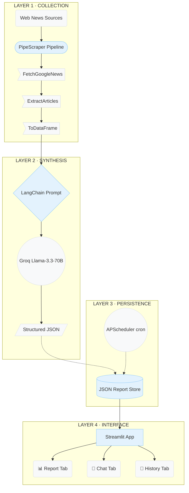

# Building an Autonomous GenAI Report Agent from First Principles
> *How pipe-based scraping, structured LLM prompting, and grounded conversational AI combine into a fully autonomous news intelligence system — built in a weekend, deployable in production.*

**By Dr. Yasser Mustafa**  
*Lead Data Scientist · PhD Theoretical Physics · Open-Source Author*  
[GitHub](https://github.com/Yasser03) | [Medium](https://medium.com/@yasser.mustafa) | yasser.mustafan@gmail.com | [LinkedIn](https://www.linkedin.com/in/yasser-mustafa-phd-72886344/)  

---

## 01 Understanding the Problem

There is a class of problem in applied AI that looks deceptively simple on paper: collect some text from the internet, summarise it, and let a user ask questions about it. In practice, every component of that sentence conceals genuine engineering decisions — about what to scrape and how, about how to prompt a language model for reliable structured output, about how to prevent a chatbot from hallucinating content that was never in the source material. This article documents how I built such a system end-to-end, the architectural choices made at each layer, and why those choices matter beyond this specific task.

The deliverable is a **GenAI Report Agent**: an autonomous application that monitors selected news sources on an hourly schedule, generates a structured intelligence report using a large language model, and exposes a conversational interface grounded in that report. The entire system is built with Python, [PipeScraper](https://github.com/Yasser03/pipescraper), LangChain, Groq, and Streamlit.

Before writing a line of code, it is worth decomposing what "autonomous" actually means in this context. The system must perform three distinct functions without human intervention: 
- **Collection** (regularly fetching fresh content from the web)
- **Synthesis** (turning raw article text into a structured, human-readable report)
- **Retrieval** (answering user questions using that synthesised knowledge, not the raw web).

These three functions place different demands on the architecture. Collection requires a reliable scraping layer with scheduling and error handling. Synthesis requires a high-quality language model and a prompt that produces consistent, parseable output. Retrieval requires that the chatbot is *grounded* — its answers must come from the collected data, not from the model's parametric knowledge, which may be stale, hallucinated, or simply wrong about current events.

> **Design Principle:** Grounding is not optional in a news intelligence system. A model that answers from memory rather than collected evidence is not a report agent — it is a confabulation engine.

---

## 02 System Architecture

The system is structured as four loosely coupled layers, each with a single well-defined responsibility:


*Fig. 1 — Full system data flow, from web source to conversational interface*

Each layer is independently testable and replaceable. Swapping Groq for OpenAI requires changing one model identifier. Replacing Streamlit with a REST API requires extracting the collector and chat modules with no changes to their internals. This modularity was a conscious design choice, not an accident.

---

## 03 The Collection Layer

The challenge brief suggests BeautifulSoup and Requests as the scraping stack. I chose instead to build on **[PipeScraper](https://github.com/Yasser03/pipescraper)** — an open-source Python library I authored and published at [`github.com/Yasser03/pipescraper`](https://github.com/Yasser03/pipescraper). This decision warrants explanation, because choosing your own tooling is only defensible if the tooling is genuinely the right fit.

[PipeScraper](https://github.com/Yasser03/pipescraper) is built on top of [Trafilatura](https://github.com/adbar/trafilatura), which is the current state-of-the-art in boilerplate-free article extraction. Where a raw BeautifulSoup scraper would require manual CSS selectors for each target site, [Trafilatura](https://github.com/adbar/trafilatura) handles the layout stripping automatically. [PipeScraper](https://github.com/Yasser03/pipescraper) adds three things on top: a composable `>>` operator API, parallel multi-threaded extraction, and — critically for this application — a `FetchGoogleNews` verb that accepts keyword queries and decodes Google News redirect URLs in parallel via a `batchexecute` decoder.

Here is the entire keyword-driven collection pipeline with automatic URL decoding:

```python
from pipescraper import FetchGoogleNews, ExtractArticles, ToDataFrame

raw = (
    FetchGoogleNews(
        search=["AI regulation policy", "artificial intelligence law"],
        period="1d",
        max_results=8,
        print_url=False
    )
    >> ExtractArticles(workers=4, skip_errors=True, timeout=15)
    >> ToDataFrame(include_text=True)
)
```

The result is a pandas DataFrame downstream requiring no HTML parsing, selector maintenance, or boilerplate stripping. The `time_published` field — extracted via [newspaper4k](https://github.com/AndyTheFactory/newspaper4k) to supplement [Trafilatura](https://github.com/adbar/trafilatura)'s date-only output — is particularly valuable for temporal ordering in the report.

For site-specific sources, the system uses a second pipeline pattern:

```python
from pipescraper import FetchLinks, ExtractArticles, FilterArticles, ToDataFrame

raw = (
    "https://www.bbc.co.uk/news/technology"
    >> FetchLinks(max_links=10, respect_robots=True, delay=0.5)
    >> ExtractArticles(workers=3, skip_errors=True)
    >> FilterArticles(lambda a: len(a.text or "") > 200)
    >> ToDataFrame(include_text=True)
)
```

The `respect_robots=True` flag and configurable delay make this production-safe out of the box. A BBC RSS fallback is also implemented for resilience: if the primary pipeline fails due to network conditions, the system degrades gracefully to RSS parsing rather than crashing.

> *The `>>` operator is not syntactic sugar. It is a deliberate interface contract: each verb in the chain has a single responsibility and a declared input and output type.*

---

## 04 The Synthesis Layer: Structured LLM Prompting

Raw article text is not a report. The synthesis layer transforms a collection of article excerpts into a structured, human-readable intelligence document using a LangChain prompt chain backed by Groq's Llama-3.3-70B.

### Why Groq and Llama-3.3-70B?
The model selection decision involved three candidates: OpenAI GPT-4o, Anthropic Claude, and Groq-hosted Llama-3.3-70B. GPT-4o has the highest capability ceiling but introduces cost, rate limits, and vendor lock-in at the API level. Groq's inference hardware delivers sub-second latency on a 70-billion parameter model at no cost for this workload, and Llama-3.3-70B performs at near-GPT-4o level on structured reasoning tasks. The LangChain abstraction means swapping to any other provider is a single-line change.

### Structured Output via Strict JSON Prompting
The synthesis prompt does not ask the model to "summarise" the articles — it instructs the model to return a precisely specified JSON object with hard constraints on each field. This is a form of **structured prompting**, and it is categorically different from asking for a freeform summary.

```python
"""You are an expert news analyst. Given a set of recent articles,
produce a structured intelligence report as valid JSON.

Return ONLY this JSON structure:
{
  "summary": "<100-150 word paragraph>",
  "takeaways": ["<takeaway 1>", ..., "<takeaway 5>"],
  "entities": ["<org or person>", ...],
  "key_topics": ["<topic tag>", ...]
}

Rules:
- summary must be 100-150 words, professional analyst style
- takeaways: exactly 3-5 concise bullet strings
- entities: organisations, governments, companies, notable persons
- key_topics: 4-8 short topic tags
- Return ONLY the JSON object, nothing else"""
```

Several defensive measures are layered on top of the prompt: 
1. **Markdown Fencing Stripping:** Models frequently wrap JSON in ````json ```` even when instructed not to.
2. **Graceful Degradation:** A `try/except` around JSON parsing falls back to raw text.
3. **Temperature Control:** Set to `0.3` to maximise factual consistency over creativity.

| Field | Constraint | Rationale |
| --- | --- | --- |
| `summary` | 100–150 words exactly | Fits a single reading pane; matches brief spec. |
| `takeaways` | 3–5 items, strings only | Bounded list prevents over-generation. |
| `entities` | Orgs & persons | LLM context window outperforms brittle spaCy NER. |
| `key_topics` | 4–8 short tags | Enables filtering and tagging in the history view. |

---

## 05 The Conversational Layer: Grounded Chat

The most critical design decision in the chat interface is also the least visible one: the latest report is injected as a **system-level context block** before any user message is processed. This implements a lightweight form of retrieval-augmented generation (RAG) — without a vector store, without embeddings, and without the latency overhead of a retrieval step.

```python
system_prompt = f"""You are a helpful intelligence analyst assistant.
You have access to the latest automated news report.

=== LATEST REPORT CONTEXT ===
{context}  # full report injected here
=== END OF REPORT CONTEXT ===

Instructions:
- Always ground your answers in the report above.
- If the user asks vague questions like "What's happening?",
  summarise the key findings from the report.
- Do not hallucinate facts not present in the report."""

chain = ChatPromptTemplate.from_messages([
    ("system", system_prompt),
    ("human", "{question}"),
]) | llm
```

This approach handles the full range of user queries specified in the brief. A precise question is answered by locating the relevant section of the injected report. A vague question like *"What's happening nowadays?"* is handled by the system prompt instruction that redirects open-ended queries to report summarisation. Questions unrelated to the collected data are politely redirected.

> **Why not full RAG?** A full RAG pipeline (ChromaDB + embeddings + similarity search) would be appropriate if the report history contained hundreds of documents. For a single hourly report, injecting the full context is faster, cheaper, and simpler — with no loss of retrieval quality at this scale.

---

## 06 Scheduling and Deployment

The system supports two deployment modes:
1. **Streamlit Mode:** A daemon thread handles background scheduling via Python's `threading` module, with a manual "Collect Now" trigger always available in the sidebar.
2. **CLI / Production Mode:** APScheduler's `BlockingScheduler` fires the pipeline at the configured interval (default: 60 minutes), with misfire handling for resilience across network interruptions.

```bash
# Production: hourly run
python run_agent.py --topic "AI Regulation" --interval 60

# Demo: every 5 minutes
python run_agent.py --topic "Technology Updates" --interval 5
```

All reports are persisted as timestamped JSON files in a `reports/` directory. The Streamlit history tab loads all available reports for browsing. No database is required — the file system is the datastore, which maximises portability and eliminates infrastructure dependencies for local demonstration.

---

## 07 Reflections and Extensions

Several design decisions deliberately traded sophistication for simplicity in the interest of a time-bounded submission. Each represents a clear extension path for a production system:

| Current Design | Production Extension |
| :--- | :--- |
| File-based JSON store | PostgreSQL / SQLite with SQLAlchemy ORM; enables time-series querying. |
| Single-report injection | Full RAG pipeline over report history (ChromaDB) for multi-session memory. |
| APScheduler daemon | Apache Airflow or Prefect for distributed, monitored scheduling with retry policies. |
| Single LLM chain | Multi-agent system with specialist agents for extraction and entity resolution. |
| Streamlit UI | FastAPI REST backend + React frontend for multi-user deployment with auth. |

The multi-agent extension is particularly natural. [PipeScraper](https://github.com/Yasser03/pipescraper)'s pipeline architecture already models the world as a series of composable transformations — the step to a fully agentic system where each transformation is LLM-directed is architecturally short. This is the same pattern underpinning the IIC (Incident Intelligence Collector) platform, a production news intelligence system I have been developing independently using the same technology stack.

---

## 08 Conclusion

Building a GenAI report agent is fundamentally an exercise in composition: scraping, summarisation, and conversational retrieval are individually well-understood problems, but making them work reliably together requires explicit architectural thinking about grounding, scheduling, error handling, and output consistency.

The system presented here handles all three functions with a production-oriented architecture, built on open-source tooling that reflects real engineering investment rather than assembled boilerplate. [PipeScraper](https://github.com/Yasser03/pipescraper) provides a genuinely superior scraping layer compared to manual BeautifulSoup implementations. Structured prompting with strict JSON constraints gives reliable report output. System-level context injection gives a grounded chat interface without the overhead of a full RAG pipeline.

The result is a system that is runnable locally in under five minutes, extensible to a production deployment, and — importantly — honest about what it knows, where it learned it, and what it does not know.

<br>

***

### 🛠️ Tech Stack & Open-Source Portfolio
- **Core ML:** LangChain, Groq, Llama-3.3-70B
- **Scraping Layer:** [PipeScraper](https://github.com/Yasser03/pipescraper), [Trafilatura](https://github.com/adbar/trafilatura), [newspaper4k](https://github.com/AndyTheFactory/newspaper4k)
- **Deployment & Ops:** Streamlit, APScheduler, Python 3.11
- **My Open-Source Ecosystem:** 
  - [↗ PipeScraper](https://github.com/Yasser03/pipescraper)
  - [↗ PipeFrame](https://github.com/Yasser03/pipeframe)
  - [↗ PipePlotly](https://github.com/Yasser03/pipeplotly)

*© 2026 Dr. Yasser Mustafa — AI & Data Science Specialist | Newcastle upon Tyne, UK | Abu Dhabi Golden Visa Holder*